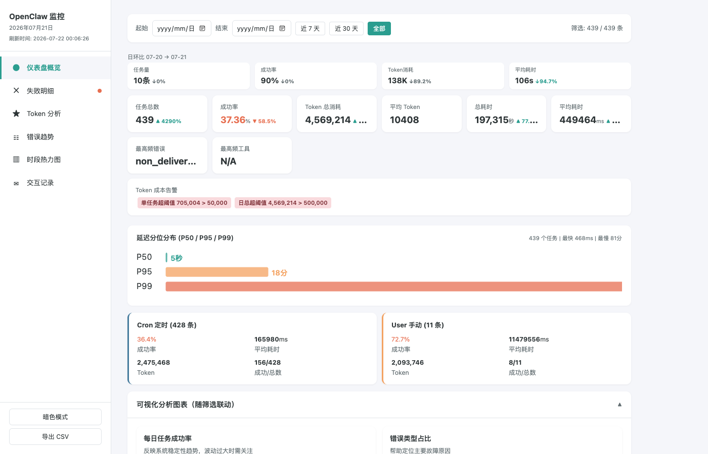

# OpenClaw Log ETL

> 一键生成 OpenClaw agent 运行日志的交互式监控仪表盘，支持定时调度、多渠道通知和日环比分析。

[](https://github.com/Barson0588/openclaw-log-etl)

<p align="center">
  
  <br><em>↑ 概览页 — KPI 日环比 + 延迟分位 + SVG 趋势图</em>
</p>

## 解决什么问题

OpenClaw agent 每天产生大量 trajectory 日志，手动翻 JSONL 文件排查问题极其低效。这个项目提供：

- **3 秒看健康度**：成功率、Token 消耗、延迟分位一目了然
- **快速定位故障**：错误趋势、失败明细、重试风暴检测
- **可追溯的交互记录**：搜索查看每次向 OpenClaw 提问的内容和结果
- **自动化运维**：定时跑 + 邮件/企微推送日报，无需人工介入

## 快速开始

```bash
# 一键启动
./run.sh --real

# 或分步执行
pip install -r requirements.txt
python main.py --now --real
```

浏览器自动打开仪表盘，一个 HTML 文件包含全部页面，无需服务器。

## 仪表盘页面

| 页面 | 功能 |
|------|------|
| **概览** | 日环比摘要条 + KPI 卡片 + 延迟分位图 + SVG 趋势图 + Cron/User 对比 |
| **失败明细** | 可排序分页的失败列表 + 重试风暴检测 + 任务详情弹窗 |
| **Token 分析** | 消耗趋势 + 分布直方图 + 成本估算 + 单任务/日总量超额告警 |
| **错误趋势** | 堆叠面积图展示各类错误日变化 |
| **时段热力图** | 24h × 日期失败率矩阵 |
| **交互记录** | 搜索/筛选所有 OpenClaw 对话，查看完整提问内容和执行结果 |

**全局特性**：日期筛选联动全部页面 · 深色模式 · CSV 导出 · 移动端适配

## 命令参考

```bash
./run.sh                  # mock 数据测试
./run.sh --real           # 检测本地 OpenClaw 数据
./run.sh --real --weekly  # 额外生成周报（环比 + 趋势）
python main.py            # 定时调度模式（每日凌晨 2:00）
```

## 部署到服务器

```bash
# 同步项目文件
rsync -avz ./ root@<host>:/root/openclaw-log-etl/

# SSH 运行
ssh root@<host> 'cd /root/openclaw-log-etl && python3 main.py --now --real --sessions-dir /home/admin/.openclaw/agents/main/sessions'
```

已在阿里云 Linux 4 + Python 3.11 验证通过（自动安装中文字体）。

## 通知配置

```bash
# SMTP 邮件
export NOTIFY_SMTP_HOST=smtp.qq.com NOTIFY_SMTP_PORT=587 \
       NOTIFY_SMTP_USER=your@qq.com NOTIFY_SMTP_PASS=your_auth_code \
       NOTIFY_TO=receiver@example.com

# 企业微信 Webhook
export NOTIFY_WECOM_WEBHOOK=https://qyapi.weixin.qq.com/cgi-bin/webhook/send?key=xxx
```

## 数据来源

读取 OpenClaw 的 `*.trajectory.jsonl` 文件，提取以下事件：

| JSONL 事件类型 | 提取字段 |
|---------------|---------|
| `session.started` | 时间戳、触发方式 (cron/user)、模型 |
| `context.compiled` | 用户提问原文 |
| `model.completed` | Token 消耗量 |
| `trace.artifacts` | 工具调用记录、错误信息 |
| `session.ended` | 最终状态、错误类型、耗时 |

## 技术栈

Python 3.9+ · pandas · matplotlib · seaborn · schedule  
纯静态 HTML 仪表盘（SVG + Vanilla JS），无框架依赖

## License

MIT
