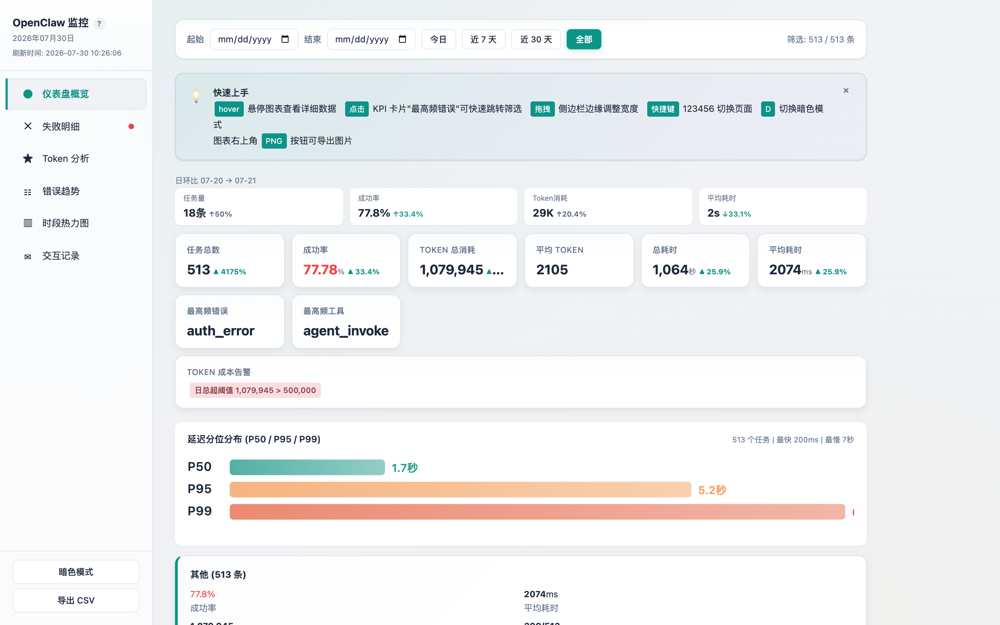
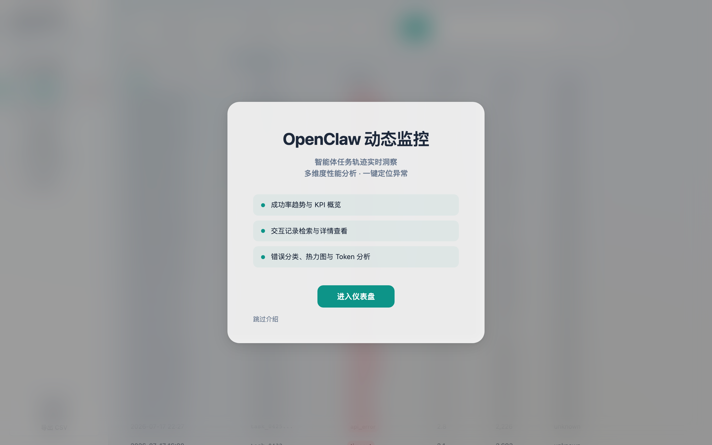
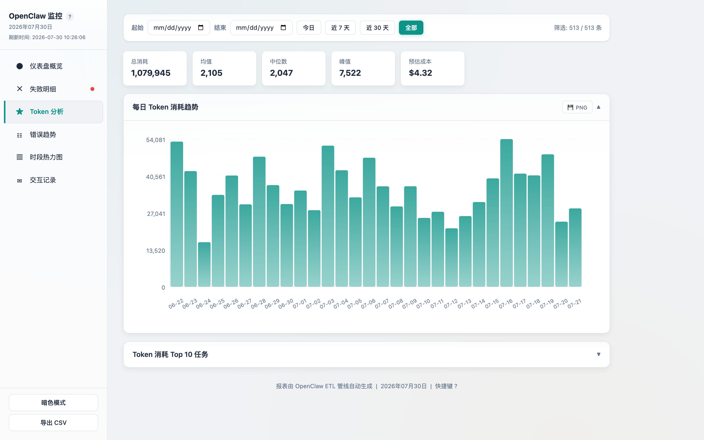
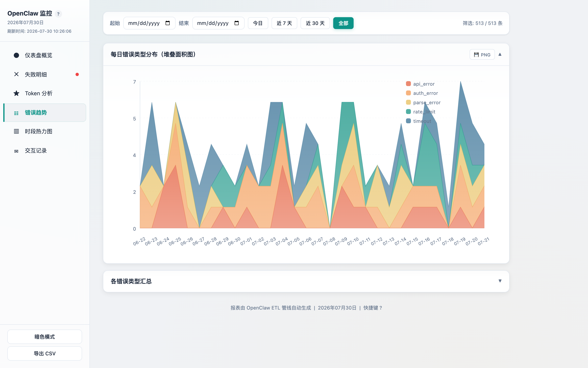
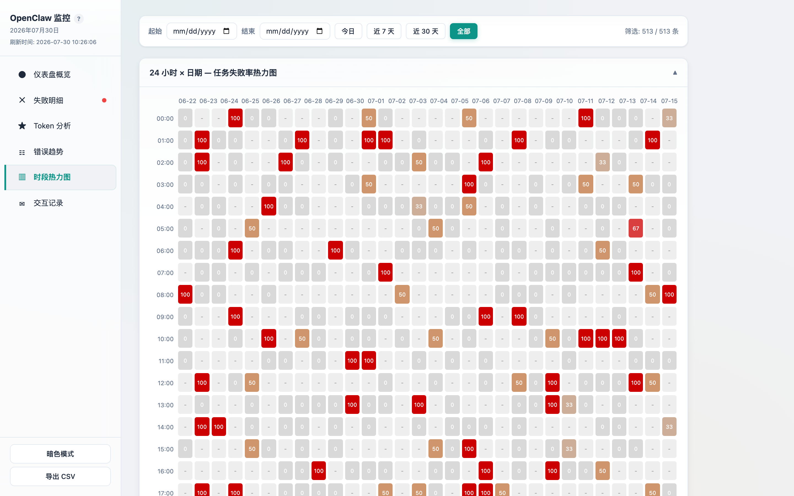
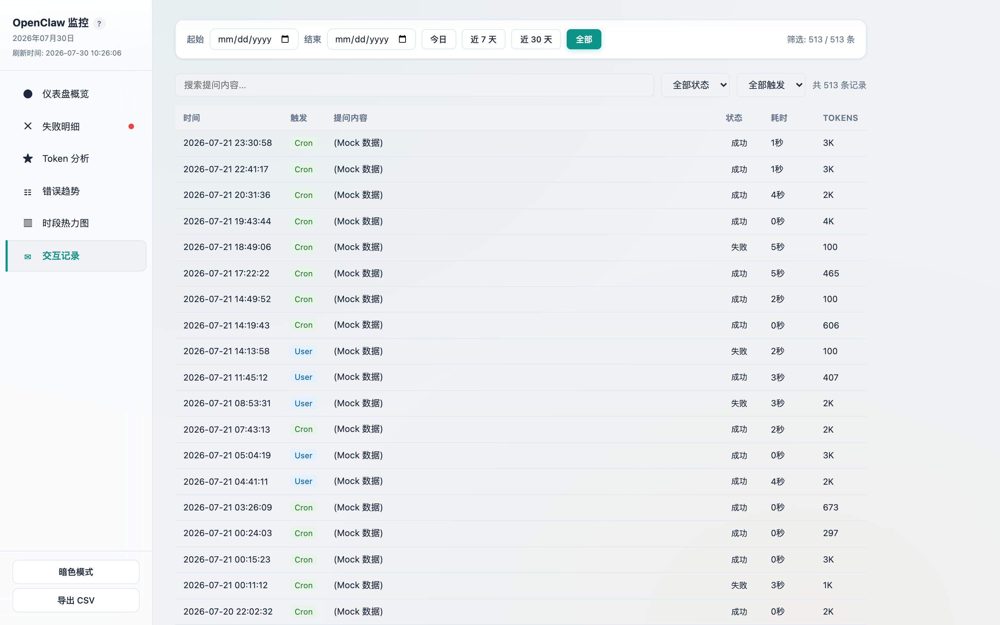

<table align="center">
<tr>
  <td width="33%">
    
    <br><em>概览 — KPI日环比 + 延迟分位 + SVG趋势</em>
  </td>
  <td width="33%">
    
    <br><em>失败明细 — 可排序分页 + 重试风暴检测</em>
  </td>
  <td width="33%">
    
    <br><em>Token 分析 — 消耗趋势 + 分布直方图 + 成本估算</em>
  </td>
</tr>
</table>

<h1 align="center">OpenClaw Log ETL</h1>

<p align="center">
  <b>OpenClaw agent 日志 → 监控仪表盘 + 多机器遥测 + 日报推送</b>
  <br><br>
  
  
  
  
  
  
</p>

---

## Why

在用 [OpenClaw](https://github.com/anthropics/openclaw) 跑 agent 集群，每天几十个任务、上百条 trajectory 日志。一开始还能手动翻 JSONL 排查——哪个 agent 挂了、为什么挂了、是不是重试风暴。但任务量一上来就不行了，几百个 JSONL 文件你要从里面定位问题，基本是噩梦。

OpenClaw 自带的日志就是一行行 JSON，没有任何可视化。所以就写了这个：**3 秒扫一眼仪表盘，知道今天系统健康不健康，不需要手动翻日志**。

后来多台机器都跑 OpenClaw，每台机器各看各的仪表盘也很烦——所以就加上了**遥测上报**：所有机器把数据推到一台中心服务器，一个 Dashboard 看全部机器状态。

## 功能

### 📊 单机仪表盘

| 页面 | 功能 |
|------|------|
| **概览** | 日环比摘要条 + KPI 卡片 + 延迟分位图 + SVG 趋势图 + Cron/User 任务分布对比 |
| **失败明细** | 可排序分页的失败列表 + 重试风暴检测 + 点开看任务详情 |
| **Token 分析** | 消耗趋势 + 分布直方图 + 成本估算 + 单任务/日总量超额告警 |
| **错误趋势** | 堆叠面积图展示各类错误日变化 |
| **时段热力图** | 24h × 日期失败率矩阵，一眼看出哪个时段最爱炸 |
| **交互记录** | 搜索/筛选所有 OpenClaw 对话，查看完整提问内容和执行结果 |

**全局特性**：日期筛选联动全部页面 · 深色模式 · CSV 导出 · 移动端凑合能用

### 🌐 多机器遥测上报（新功能）

如果你有多台机器跑 OpenClaw（比如一台 MacBook 本地开发 + 一台 Linux 服务器跑 cron 任务），可以把所有机器的数据汇总到一个 Dashboard：

```
┌──────────┐  ┌──────────┐  ┌──────────┐
│ MacBook  │  │ OfficePC │  │ 阿里云   │
│ reporter │  │ reporter │  │ reporter │
└────┬─────┘  └────┬─────┘  └────┬─────┘
     │ 每5分钟      │             │
     ▼             ▼             ▼
┌─────────────────────────────────────┐
│         中心监控服务器               │
│  /api/v1/telemetry                  │
│  dashboard_multi.html               │
└─────────────────────────────────────┘
```

每台机器通过 cron 每 5 分钟自动上报 trajectory 数据到中心服务器，支持：
- 自动去重（已上报的 task_id 不重复发）
- 上报失败静默重试（不阻塞机器上的 OpenClaw 主进程）
- 多客户端对比仪表盘（`dashboard_multi.html`）

### 🔌 后台上报模块

除了 cron 方式，也提供 Python SDK 模式——以守护线程跑在 OpenClaw 进程内，默认 60 秒上报一次，异常隔离不影响主进程：

```python
from client.client_skill import OpenClawReporter
reporter = OpenClawReporter()
reporter.start()  # 后台线程，3次指数退避重试
```

## 截图展示

<table>
<tr>
  <td width="50%"><br><em>概览 — KPI 卡片 + 延迟分位 + SVG 趋势图</em></td>
  <td width="50%"><br><em>失败明细 — 可排序分页列表 + 重试风暴检测</em></td>
</tr>
<tr>
  <td><br><em>Token 分析 — 消耗趋势 + 分布直方图 + 成本估算</em></td>
  <td><br><em>错误趋势 — 堆叠面积图展示各类错误日变化</em></td>
</tr>
<tr>
  <td><br><em>时段热力图 — 24h × 日期失败率矩阵</em></td>
  <td><br><em>交互记录 — 搜索/筛选对话，查看提问原文</em></td>
</tr>
</table>

## 快速开始

### 单机仪表盘

```bash
# 有本地 OpenClaw 数据
./run.sh --real

# 没数据想先看效果（用 mock 数据）
./run.sh
```

浏览器自动打开，一个 HTML 文件 = 完整仪表盘，不需要起服务器。

### 多机器遥测（中心服务器）

```bash
# 在中心服务器上启动监控服务
python3 -m server.manage serve --port 8000

# 注册客户端，获取 API Key
python3 -m server.manage register-client <client-id> <客户端名称>
```

### 接入新机器

```bash
# 在新机器上运行 setup
bash skills/openclaw-monitor/scripts/setup.sh
```

按提示输入服务器地址、客户端名称、API Key。脚本会自动装依赖、配 cron、测通。

接入后在服务器上打开 `dashboard_multi.html` 就能看到所有机器的数据对比。

## 命令参考

```bash
# 单机模式
./run.sh                  # mock 数据测试
./run.sh --real           # 检测本地 OpenClaw 数据
./run.sh --real --weekly  # 额外生成周报（环比 + 趋势）

# 定时调度
python main.py            # 定时调度模式（默认每天凌晨 2:00）

# 遥测上报（手动触发）
python3 skills/openclaw-monitor/scripts/reporter.py

# 中心服务器
python3 -m server.manage serve --port 8000
python3 -m server.manage register-client <id> <name>
```

## 部署到服务器

我自己用的场景：阿里云轻量服务器同时跑监控服务端 + 作为 OpenClaw 任务机。

```bash
# 同步文件
rsync -avz ./ root@<host>:/root/openclaw-log-etl/

# 启动监控服务端
ssh root@<host>
cd /root/openclaw-log-etl
python3 -m server.manage serve --port 8000 &

# 设 cron（仪表盘日报 + 遥测上报）
crontab -e
# 0 2 * * * cd /root/openclaw-log-etl && python3 main.py --now --real --sessions-dir /home/admin/.openclaw/agents/main/sessions
# */5 * * * * cd /root/openclaw-log-etl && python3 skills/openclaw-monitor/scripts/reporter.py
```

阿里云 Linux 4 + Python 3.11 验证通过。中文显示需要字体（脚本会自动装，如果失败手动 `apt install fonts-wqy-zenhei`）。

## 通知配置

```bash
# SMTP 邮件（我用的 QQ 邮箱，其他 SMTP 应该也行）
export NOTIFY_SMTP_HOST=smtp.qq.com NOTIFY_SMTP_PORT=587 \
       NOTIFY_SMTP_USER=your@qq.com NOTIFY_SMTP_PASS=your_auth_code \
       NOTIFY_TO=receiver@example.com

# 企业微信 Webhook
export NOTIFY_WECOM_WEBHOOK=https://qyapi.weixin.qq.com/cgi-bin/webhook/send?key=xxx
```

## 数据来源

读取 OpenClaw 的 `*.trajectory.jsonl` 文件，提取以下事件：

| JSONL 事件类型 | 提取字段 |
|---------------|---------|
| `session.started` | 时间戳、触发方式 (cron/user)、模型 |
| `context.compiled` | 用户提问原文 |
| `model.completed` | Token 消耗量 |
| `trace.artifacts` | 工具调用记录、错误信息 |
| `session.ended` | 最终状态、错误类型、耗时 |

## 项目结构

```
openclaw-log-etl/
├── main.py              # 主入口（调度/单次运行）
├── data_pipeline.py     # JSONL → Pandas DataFrame 清洗
├── analyzer.py          # 统计分析（延迟分位、异常检测）
├── report_generator.py  # HTML 仪表盘生成
├── watcher.py           # 文件监控（增量处理）
├── notify.py            # 邮件/企微推送
├── openclaw_adapter.py  # 适配不同版本 OpenClaw 日志格式
├── generate_mock_data.py # Mock 数据生成器（演示用）
├── client/              # 遥测上报 SDK（Python daemon 模式）
│   └── client_skill.py  # OpenClawReporter 守护线程
├── server/              # 中心监控服务端（多机器数据汇总）
├── skills/              # OpenClaw 技能插件
│   └── openclaw-monitor/
│       ├── SKILL.md      # 技能说明
│       └── scripts/
│           ├── setup.sh      # 一键接入脚本
│           └── reporter.py   # cron 上报脚本
├── templates/           # 仪表盘 HTML 模板
│   ├── dashboard.html       # 单机版
│   └── dashboard_multi.html # 多客户端对比版
└── docs/                # 设计文档
```

## 技术栈

Python 3.9+ · pandas · matplotlib · seaborn · schedule · httpx  
纯静态 HTML 仪表盘（SVG + Vanilla JS），无框架依赖  
遥测层：HTTP POST + JSON，cron 定时 or Python daemon 线程

## 已知问题

- **大项目（1000+ sessions）加载会慢**。不是逻辑慢，是浏览器渲染那么多 SVG 图表需要时间。大项目建议加 `--days 3` 限制范围
- **Windows 没测过**。macOS 开发 + Linux 部署。Python 脚本理论上都能跑，但中文字体设置那部分可能会炸
- **企业微信通知偶尔丢消息**。API 限频，短时间发太多会被静默丢弃
- **setup.sh 路径探测**：如果 OpenClaw 以非默认用户运行（比如 admin），setup.sh 可能探测不到 sessions 目录。手动改 `~/.openclaw-monitor/config.sh` 里的 `SESSIONS_DIR` 即可

## License

MIT — 自己用的工具顺便开源了。有 Bug 提 issue，急的话直接邮件。

---

<p align="center">
  <sub>一个人维护，更新随缘。如果有人用且觉得有用，留个 Star ⭐ 就很开心了。</sub>
</p>
