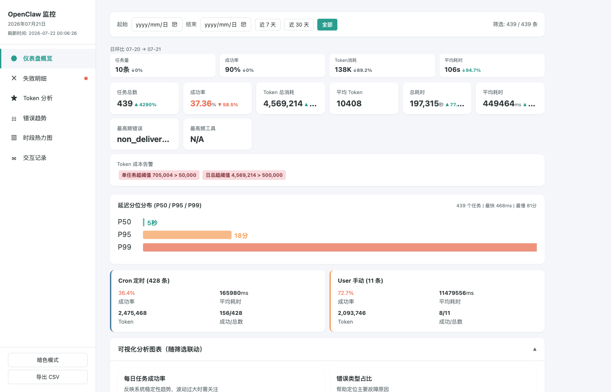

<p align="center">
  
  <br><em>概览页 — KPI 日环比 + 延迟分位 + SVG 趋势图</em>
</p>

<h1 align="center">OpenClaw Log ETL</h1>

<p align="center">
  <b>OpenClaw agent 运行日志 → 交互式监控仪表盘 + 日报推送</b>
  <br><br>
  
  
  
  
  
</p>

---

## Why

在用 [OpenClaw](https://github.com/anthropics/openclaw) 跑 agent 集群，每天几十个任务、上百条 trajectory 日志。一开始还能手动翻 JSONL 排查——哪个 agent 挂了、为什么挂了、是不是重试风暴。但任务量一上来就不行了，几百个 JSONL 文件你要从里面定位问题，基本是噩梦。

OpenClaw 自带的日志就是一行行 JSON，没有任何可视化。所以就写了这个：**3 秒扫一眼仪表盘，知道今天系统健康不健康，不需要手动翻日志**。

## 仪表盘能看什么

| 页面 | 功能 |
|------|------|
| **概览** | 日环比摘要条 + KPI 卡片 + 延迟分位图 + SVG 趋势图 + Cron/User 任务分布对比 |
| **失败明细** | 可排序分页的失败列表 + 重试风暴检测 + 点开看任务详情 |
| **Token 分析** | 消耗趋势 + 分布直方图 + 成本估算 + 单任务/日总量超额告警 |
| **错误趋势** | 堆叠面积图展示各类错误日变化 |
| **时段热力图** | 24h × 日期失败率矩阵，一眼看出哪个时段最爱炸 |
| **交互记录** | 搜索/筛选所有 OpenClaw 对话，查看完整提问内容和执行结果 |

**全局特性**：日期筛选联动全部页面 · 深色模式 · CSV 导出 · 移动端凑合能用

## 快速开始

```bash
# 有本地 OpenClaw 数据
./run.sh --real

# 没数据想先看效果（用 mock 数据）
./run.sh
```

浏览器自动打开，一个 HTML 文件 = 完整仪表盘，不需要起服务器。

## 命令参考

```bash
./run.sh                  # mock 数据测试
./run.sh --real           # 检测本地 OpenClaw 数据
./run.sh --real --weekly  # 额外生成周报（环比 + 趋势）
python main.py            # 定时调度模式（默认每天凌晨 2:00）
```

## 部署到服务器

我自己用的场景：阿里云轻量服务器，cron 每天跑一次，结果发邮件。

```bash
# 同步文件
rsync -avz ./ root@<host>:/root/openclaw-log-etl/

# SSH 上去设 cron
ssh root@<host>
crontab -e
# 加上：0 2 * * * cd /root/openclaw-log-etl && python3 main.py --now --real --sessions-dir /path/to/sessions
```

阿里云 Linux 4 + Python 3.11 验证通过。中文显示需要字体（脚本会自动装，如果失败手动 `apt install fonts-wqy-zenhei`）。

## 通知配置

```bash
# SMTP 邮件（我用的 QQ 邮箱，其他 SMTP 应该也行）
export NOTIFY_SMTP_HOST=smtp.qq.com NOTIFY_SMTP_PORT=587 \
       NOTIFY_SMTP_USER=your@qq.com NOTIFY_SMTP_PASS=your_auth_code \
       NOTIFY_TO=receiver@example.com

# 企业微信 Webhook
export NOTIFY_WECOM_WEBHOOK=https://qyapi.weixin.qq.com/cgi-bin/webhook/send?key=xxx
```

## 数据来源

读取 OpenClaw 的 `*.trajectory.jsonl` 文件，提取以下事件：

| JSONL 事件类型 | 提取字段 |
|---------------|---------|
| `session.started` | 时间戳、触发方式 (cron/user)、模型 |
| `context.compiled` | 用户提问原文 |
| `model.completed` | Token 消耗量 |
| `trace.artifacts` | 工具调用记录、错误信息 |
| `session.ended` | 最终状态、错误类型、耗时 |

## 项目结构

```
openclaw-log-etl/
├── main.py              # 主入口（调度/单次运行）
├── data_pipeline.py     # JSONL → Pandas DataFrame 清洗
├── analyzer.py          # 统计分析（延迟分位、异常检测）
├── report_generator.py  # HTML 仪表盘生成
├── watcher.py           # 文件监控（增量处理）
├── notify.py            # 邮件/企微推送
├── openclaw_adapter.py  # 适配不同版本 OpenClaw 日志格式
├── generate_mock_data.py # Mock 数据生成器（演示用）
├── client/              # 前端 JS（仪表盘交互）
├── server/              # 可选 Web 服务模式
└── templates/           # Jinja2 模板
```

## 技术栈

Python 3.9+ · pandas · matplotlib · seaborn · schedule  
纯静态 HTML 仪表盘（SVG + Vanilla JS），无框架依赖

## 已知问题

- **大项目（1000+ sessions）加载会慢**。不是逻辑慢，是浏览器渲染那么多 SVG 图表需要时间。大项目建议加 `--days 3` 限制范围
- **Windows 没测过**。macOS 开发 + Linux 部署。Python 脚本理论上都能跑，但中文字体设置那部分可能会炸
- **企业微信通知偶尔丢消息**。API 限频，短时间发太多会被静默丢弃

## License

MIT — 自己用的工具顺便开源了。有 Bug 提 issue，急的话直接邮件。

---

<p align="center">
  <sub>一个人维护，更新随缘。如果有人用且觉得有用，留个 Star ⭐ 就很开心了。</sub>
</p>
